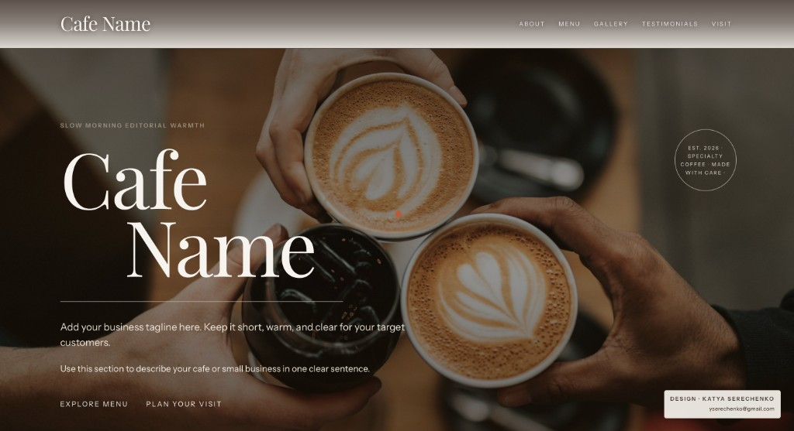

# Cafe Template 




Production-ready reusable website template for cafes, bakeries, dessert shops, and other local businesses.

## Stack

- Next.js App Router
- Tailwind CSS v4
- Framer Motion
- TypeScript

## Quick Start

```bash
npm install
npm run dev
```

Visit [http://localhost:3000](http://localhost:3000).

## Template Architecture

```text
src/
  app/
    globals.css
    layout.tsx
    page.tsx
  components/
    Navbar.tsx
    Hero.tsx
    About.tsx
    Menu.tsx
    Gallery.tsx
    Testimonials.tsx
    Visit.tsx
    Footer.tsx
    SectionWrapper.tsx
  data/
    siteConfig.ts
  lib/
    animations.ts
```

## Rebrand in Minutes

Everything is controlled from `src/data/siteConfig.ts`:

- business details (name, tagline, phone, address, hours, socials)
- section content (about, menu, gallery, testimonials, visit)
- section visibility toggles
- theme preset (colors + typography)

Change the config and the whole website updates.

## Section Toggles

Enable or disable sections in:

- `siteConfig.sections.about`
- `siteConfig.sections.menu`
- `siteConfig.sections.gallery`
- `siteConfig.sections.testimonials`
- `siteConfig.sections.visit`

Navigation links automatically update based on enabled sections.

## Gallery Modes

Set `siteConfig.gallery.layout` to:

- `"grid"` for masonry-like card grid
- `"carousel"` for horizontal scroll-snap slider

## Animation System

Reusable animation variants are in `src/lib/animations.ts`:

- `fadeUp`
- `staggerContainer`
- `hoverLift`
- `softZoom`

